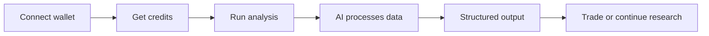

<h1 align="center">Akari Pulse</h1>

  
<strong>AI-native on-chain analytics and trading terminal for Solana</strong>

  

    Token intelligence • Wallet profiling • Narrative research • Real-time terminal • Credit-based execution
  

  <a href="#overview">Overview</a>
  ·
  <a href="#product-surfaces">Product Surfaces</a>
  ·
  <a href="#core-features">Core Features</a>
  ·
  <a href="#credits--plans">Credits & Plans</a>
  ·
  <a href="#api--integration">API</a>
  ·
  <a href="#security--privacy">Security</a>
  ·
  <a href="#risk--model-limitations">Risk Notice</a>

---

### Quick Links

---

## Overview

> [!IMPORTANT]
> AkariPulse is an AI-native on-chain analytics and trading platform for Solana

It provides structured intelligence and execution tools in one interface

---

## What It Does

> [!TIP]
> AkariPulse turns raw on-chain and market data into actionable insights

Core capabilities:

- AI-powered **Token Analytics** with unified risk scoring
- **Wallet Analytics** with labels, allocation, and behavior insights
- **Narrative Radar** for tracking market attention and sentiment
- Real-time **Terminal** with integrated trading via Jupiter
- Credit-based usage powered by `$AKARI`

Instead of switching between tools, users operate inside one loop:

**Discover → Analyze → Decide → Execute**

---

## Live Preview / Screenshots

> [!NOTE]
> UI previews will be added here

- Terminal view
- Token analytics report
- Wallet analytics dashboard
- Narrative digest

---

## Key Features

### Token Analytics
- unified risk score (0–100)
- contract + trading risk
- liquidity and holder analysis
- structured AI-generated reports

### Wallet Analytics
- wallet classification and labels
- portfolio allocation breakdown
- concentration and exposure metrics

### Narrative Radar
- AI-generated market narratives
- token and sector-level digests
- sentiment and attention tracking

### Terminal
- real-time token discovery
- multiple market views
- integrated swap via Jupiter

---

## Try It

> [!IMPORTANT]
> Access AkariPulse via:

- Web App → https://app.akaripulse.com  
- API → https://api.akaripulse.com  
- Telegram Mini App → (link)

### Quick Start

1. Connect your wallet  
2. Receive free credits  
3. Run your first token or wallet analysis  
4. Explore results and continue into Terminal  

---

## Integrations

> [!NOTE]
> AkariPulse connects with key Solana infrastructure

- Jupiter (trading execution)
- Solana wallets (non-custodial auth)
- On-chain data providers
- Internal AI analysis engine

---

## Tech Stack

> [!TIP]
> High-level architecture overview

- Frontend: Web App + Telegram Mini App  
- Backend: API + job queue system  
- AI Layer: structured analysis engine  
- Blockchain: Solana  
- Execution: Jupiter integration  

---

## How It Works

---

## Disclaimer

> [!WARNING]
> AkariPulse provides analytics only

- not financial advice
- outputs may be inaccurate or incomplete
- users are fully responsible for decisions
- crypto markets are high risk
