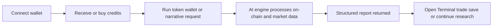

<p align="center">


</p>
<h1 align="center">Akari Pulse</h1>
<div align="center">
  <p><strong>AI-native on-chain analytics and trading terminal for Solana</strong></p>
  <p>
    Token intelligence • Wallet profiling • Narrative research • Real-time terminal • Credit-based execution
  </p>
</div>


### 🚀 Quick Links

[](https://твоя-web-app-ссылка)

[](https://t.me/твой_мини_апп)

[](https://твои-docs-ссылка)

[](https://x.com/твой_аккаунт)

[](https://t.me/твоя_группа_или_канал)


---

[](https://твоя-web-app-ссылка)
[](https://t.me/твой_мини_апп)
[](https://твои-docs-ссылка)
[](https://x.com/твой_аккаунт)
[](https://t.me/твоя_группа_или_канал)

---

<p align="center">
  <a href="#overview">Overview</a>
  ·
  <a href="#product-surfaces">Product Surfaces</a>
  ·
  <a href="#core-features">Core Features</a>
  ·
  <a href="#credits--plans">Credits & Plans</a>
  ·
  <a href="#api--integration">API</a>
  ·
  <a href="#security--privacy">Security</a>
  ·
  <a href="#risk--model-limitations">Risk Notice</a>
</p>

---


---


## Overview

AkariPulse is an AI-native analytics and execution platform built for Solana traders and crypto users who want faster insight, clearer risk framing, and direct action from a single interface

The platform combines:

- on-demand token analytics
- wallet intelligence
- narrative research
- a live trading terminal
- credit-based access powered by `$AKARI`

AkariPulse is designed around a simple flow:

**Discover → Analyze → Decide → Trade or avoid**

---

## Why AkariPulse

Raw blockchain explorers show transactions

AkariPulse turns on-chain and market data into structured decisions

Instead of jumping between dashboards, feeds, charts, wallets, and bots, users can work inside one product loop:

- find a token in the Terminal
- open a token report
- inspect holders and wallet behavior
- request a narrative digest
- swap via Jupiter when ready

---

## Product Surfaces

### Web App
The primary interface for the full AkariPulse experience

Includes:
- Terminal
- Token Analytics
- Wallet Analytics
- Burn Dashboard
- Profile
- Plan & Billing
- Usage logs
- Beta tools

### Telegram Mini App
Fast, chat-like access to AkariPulse agents inside Telegram

Best for:
- quick token summaries
- wallet snapshots
- narrative digests

### API
Programmatic access for advanced users, tools, and partner integrations

Best for:
- custom dashboards
- automations
- internal workflows
- analytics pipelines

---

## Core Features

## Token Analytics

AI-generated token reports that turn raw data into a structured risk view

### What it includes

- unified risk score from `0` to `100`
- contract risk and trading risk split
- liquidity profile
- holder distribution and concentration
- price and volatility context
- market structure commentary
- practical interpretation for different trader profiles

### Example report logic

- **Final Risk Score** → overall risk framing
- **Contract Risk** → ownership, mint or freeze state, LP lock or burn status, structural flags
- **Trading Risk** → volatility, slippage, route depth, spread behavior, hostile execution conditions
- **Holder Risk** → whale dominance, concentration, growth quality
- **Bot Risk** → sandwich activity, bot presence, abnormal flow

### Typical output

- headline summary
- key points
- metric strip
- price and liquidity breakdown
- security assessment
- community and market context
- actionable interpretation block

---

## Wallet Analytics

Wallet Analytics turns any supported wallet into a portfolio profile with labels, allocation analysis, and concentration insight

### What it includes

- wallet classification
- behavior labels
- allocation by asset category
- top holding concentration
- average and max token risk
- hedge quality assessment
- practical commentary on structure and exposure

### Example labels

- `SOL Maxi`
- `No Hedge`
- `Bluechip Heavy`
- `Meme Hunter`
- `Small Retail`
- `Whale`

### Typical questions it answers

- Is this wallet diversified or all-in
- Does it behave like a degen, farmer, or directional holder
- Is this structure worth copying or fading
- Where is the real portfolio risk coming from

---

## Narrative Radar

Narrative Radar is an AI agent focused on news, social signals, and evolving market narratives

### What it does

- clusters discussion into narratives
- tracks attention intensity and direction
- generates token-focused digests
- generates sector or theme digests
- adds context around why a token is being discussed right now

### Query types

- **Token-focused**
  - example: `Give me a narrative summary for token X`
- **Sector-focused**
  - example: `Show me current narratives around Solana memes`

### Digest structure

- headline summary
- key drivers
- risk and caveats
- practical takeaway

> [!NOTE]
> Narrative Radar reflects what is being talked about  
> It does not predict what should happen next

---

## Terminal

The Terminal is the real-time market layer inside AkariPulse

It allows users to monitor tokens, sort by momentum and volume, open analysis instantly, and execute swaps through Jupiter

### Terminal includes

- live token list
- market views
- timeframe switching
- token detail drawer
- quick actions for Analyze and Swap
- market status and update visibility

### Supported views

- Trending
- Volume
- Top Performing
- Graduating
- Graduated

### Supported timeframes

- `5m`
- `15m`
- `30m`
- `1h`
- `4h`
- `24h`

### Execution flow

1. Select a token
2. Open token detail
3. Run analysis if needed
4. Swap via Jupiter
5. Confirm in wallet

> [!IMPORTANT]
> AkariPulse never takes custody of funds  
> All swaps are executed on-chain through Jupiter with explicit wallet confirmation

---

## Token Design Beta

Token Design is a simulation layer for exploring tokenomics before launch

It does not deploy contracts  
It does not predict price  
It helps teams reason about structure

### It can model

- total supply
- allocations
- vesting and unlock cliffs
- emissions and rewards
- burns and sinks
- treasury policy
- scenario branches

### Scenario types

- Base Case
- Growth Case
- Stress Case

### Key outputs

- circulating supply over time
- allocation shifts
- burn versus emissions
- unlock calendar
- structural warnings

---

## Burn Dashboard

The Burn Dashboard gives transparent on-chain visibility into how `$AKARI` is burned and how treasury allocations move

### Dashboard focus

- total `$AKARI` burned
- burned value in USD
- current circulating supply
- treasury balance
- recent burn events
- burn and treasury charts over time

### Why it exists

Every credit purchase is tied to on-chain token routing  
The dashboard acts like a public audit layer for that flow

---

## How It Works



## Session Lifecycle

1. Authenticate with wallet  
2. Use free credits or purchase more with $AKARI  
3. Trigger an on-demand request  
4. Receive structured output  
5. Continue into deeper research or execution  

---

## Credits & Plans

AkariPulse uses a **usage-based credit model**

Users spend credits only when they run actions

### Example credit costs

| Action | Credit Cost |
|------|------:|
| Token Analysis | 0.6 |
| Wallet Analysis | 0.85 |
| Narrative Digest | plan-defined |
| Token Design Simulation | beta / plan-defined |

### Plans

| Plan | Monthly Price | Credits |
|------|-------------:|--------:|
| Free | $0 | 10 |
| Lite | $9.99 | 30 |
| Pro | $19.99 | 80 |
| Max | $49.99 | 300 |

### Plan logic

- monthly renewal  
- monthly credit pool  
- shared usage across all official surfaces  
- top-up or upgrade when balance is low  

---

## $AKARI Utility

$AKARI is the native utility token behind the platform credit flow

### Core roles

- payment asset for plans and credits  
- access path for advanced features  
- fee alignment and discount potential  
- usage-linked token demand  

### Purchase routing

- **80%** of purchase flow is burned  
- **20%** is routed to treasury  

### Why this matters

As platform usage grows, more spend can move through the same burn and treasury loop  

---

## Product Loop

AkariPulse is not built as isolated tools

Each surface strengthens the next step

### Typical flow

1. Discover a token in the Terminal  
2. Open Token Analytics  
3. Review holders and risks  
4. Jump into Wallet Analytics for major participants  
5. Request a Narrative Radar digest  
6. Return to the Terminal to act or skip  

This creates a tighter research and execution cycle than using disconnected tools  

---

## API & Integration

AkariPulse exposes a JSON API for advanced users and integrations

### Authentication

All requests use a bearer key linked to a primary wallet

```http
Authorization: Bearer <AKARIPULSE_API_KEY>
```
Core endpoints
POST /v1/analysis/token
POST /v1/analysis/wallet
POST /v1/analysis/narrative
GET  /v1/analysis/:id
GET  /v1/credits/balance
GET  /v1/usage?from=2026-03-01&to=2026-03-04
Example TypeScript client
```
import fetch from 'node-fetch'

const API_KEY = process.env.AKARIPULSE_API_KEY!
const API_URL = 'https://api.akaripulse.com'

async function runTokenScan(tokenAddress: string) {
  const res = await fetch(`${API_URL}/v1/analysis/token`, {
    method: 'POST',
    headers: {
      Authorization: `Bearer ${API_KEY}`,
      'Content-Type': 'application/json'
    },
    body: JSON.stringify({
      tokenAddress,
      surface: 'web'
    })
  })

  const body = await res.json()

  if (!body.ok) {
    throw new Error(body.message || 'API error')
  }

  return body.data ?? body
}
Example usage response
{
  "ok": true,
  "data": [
    {
      "ts": "2026-03-04T21:48:00Z",
      "kind": "token",
      "target": "So11111111111111111111111111111111111111112",
      "surface": "web",
      "creditsDelta": -0.6
    },
    {
      "ts": "2026-03-04T21:50:10Z",
      "kind": "wallet",
      "target": "BsNjLfBhHn8hjyU9pWYV1T5v8j5Y9nj5U9pWYV1T5v8j",
      "surface": "telegram",
      "creditsDelta": -0.85
    }
  ]
}****
```
